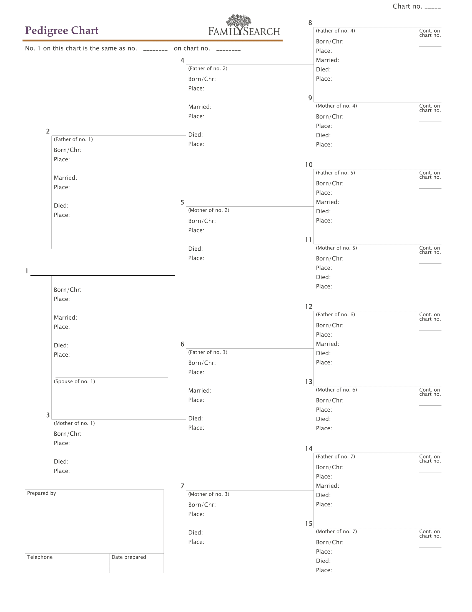
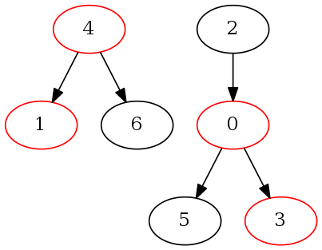

```@meta
CurrentModule = RedBlackGraph
```

# RedBlackGraph.jl

Documentation for [RedBlackGraph](https://github.com/rappdw/RedBlackGraph.jl). RedBlackGraphs are DAGs of interleaved
Binary Trees.

```@index
```

## Introduction

When representing binary relationships, such as familial relationships, a number of approaches may be utilized
including: ad-hoc, general graphs, specialized tables or charts. As I've explored different representations, a
specialized mathematical representation has emerged. This mathematical representation is useful as the underpinnings of
dynamic graph algorithms for use cases that include graph analysis, relationship calculation, loop detection, loop
prevention, etc.

The underlying mathematical model is a directed, acyclic graph of multiple, interleaved binary trees, designated as a
RedBlackGraph. The name, RedBlackGraph, derives from superficial similarity to Red Black Trees. Red Black Trees are
binary trees such that each node has an extra, color bit (red or black). This color bit is used to balance the tree as
modifications are made. In a RedBlackGraph each vertex also has an extra, color bit, rather than utilizing the color bit
for balancing, the color bit is used to constrain edges between vertices.

I will provide a formal definition of a RedBlackGraph, as well as explore a number of interesting emergent properties. I
will also examine several applications of RedBlackGraphs to illustrate the utility of using this mathematical model for
familial relationships.

## Formal Definition

A RedBlackGraph is a network, ``\mathscr{N}``, consisting of a directed graph, ``G = (V,E)``, and a relationship
function, ``r(\mathbf{u},\mathbf{v})\rightarrow \{\mathbb{A}\}``. Where:

1. ``\mathbb{A}``, Avus numbers,
   are: ``\mathbb{N} \cup \{0, {\color{red}1}\}`` ``\text{where: }\begin{cases} {\color{red}1} \lt 1, \\ {\color{red}1} \text{ is even}, \\ \text{otherwise }{\color{red}1} \text{ behaves as }1 \end{cases}``
2. Any given vertex must have a color, either red or black
3. Any given vertex can have at most one outbound edge to a vertex of a given color
4. Every vertex has an edge to itself
   where: ``r(\mathbf{v},\mathbf{v})\rightarrow \begin{cases} {\color{red}1}, & \text{if }{\mathbf{v}} \text{ is a red vertex}, \\1, & \text{if }\mathbf{v}\text{ is a black vertex} \end{cases}``
5. If there is no path in ``G`` from ``\mathbf{u}`` to ``\mathbf{v}``, ``r(\mathbf{u},\mathbf{v})\rightarrow 0``
6. For all other ``\mathbf{u}``, ``\mathbf{v}`` not covered by constraints 4 and
   5, ``r(\mathbf{u},\mathbf{v})\rightarrow x``, were ``x`` is generated by walking the shortest path (assume uniform
   edge weights) from ``\mathbf{u}`` to ``\mathbf{v}`` as follows:
    1. ``x \leftarrow 1``
    2. walk the edge along the shortest path and update ``x`` as
       follows: ``x \leftarrow \begin{cases} x \ll 0, & \text{if resultant vertex is red}, \\ x \ll 1, & \text{if resultant vertex is black} \end{cases}`` (``\ll``
       is bitwise shift left)
    3. repeat step two until ``\mathbf{v}`` is reached

(Note: a new class of numbers are defined, Avus numbers, as above. Avus, in Latin, refers to ancestors. As this number system is
derived from working on representing ancestry, the name seems appropriate.)

### Motivation

The relationships resulting from sexual reproduction can be modeled by a RedBlackGraph, arbitrarily assigning vertices
that are male as Red and vertices that are female as Black with direction of edges being from the offspring to the
parent.


### Observation

For a given vertex in a RedBlackGraph there are two distinct sub-graphs or "views" or perspectives, for a given vertex:
Descendancy and Ancestry.

**Descendancy** is the sub-graph for a given vertex that consists of all vertices and edges that can follow a graph
traversal and arrive at the given node.


**Ancestry** is the sub-graph for a given vertex that consists of all the vertices and edges reachable by following
out-bound edges. This sub-graph is a well-formed binary tree.


The Ancestry sub-graph from a given ``\mathbf{u}`` is a well-formed binary tree. ``r(\mathbf{u},\mathbf{v})`` is defined
as to number the nodes of the tree as they are encountered in a breadth first search. A concrete example
of ``r(\mathbf{u},\mathbf{v})`` is observed in a pedigree chart (common in family history research). See fig. Pedigree
Chart.



## RedBlackGraph Adjacency Matrices and Avus Arithmetic

### Adjacency Matrix

An adjacency matrix is a square matrix used to represent a graph. The elements of the matrix are 1 (or edge weight) if
there is an edge between the vertices represented by the column index and the row index. Slightly more formally,
for ``G`` with a vertex set ``V``, the adjacency matrix is a square ``|V|`` x ``|V|`` matrix, ``A`` such that ``A_{ij}``
is ``1`` if there exists an edge from ``\mathbf{i}`` to ``\mathbf{j}`` and ``0`` otherwise.

Given the above example graph and choosing indices for the vertices as follows: 0 - Female Offspring, 1 - Male
Offspring, 2 - Male Progenitor, 3 - Female Progenitor, the graph would be represented by the following adjacency matrix.

$$A = \begin{bmatrix} 0 & 0 & 1 & 1 \\ 0 & 0 & 1 & 1 \\ 0 & 0 & 0 & 0 \\ 0 & 0 & 0 & 0 \\ \end{bmatrix}$$

### RedBlackGraph Adjacency Matrix

Let's define the adjacency matrix for a RedBlackGraph only slightly differently. ``R_{ij}=r(\mathbf{i}, \mathbf{j})`` if
there is a relationship from ``\mathbf{i}`` to ``\mathbf{j}`` and ``0`` otherwise. The following is the RedBlackGraph
adjacency matrix for the above example graph.

$$R = \begin{bmatrix} 1 & 0 & 2 & 3 \\ 0 & {\color{red}1} & 2 & 3 \\ 0 & 0 & {\color{red}1} & 0 \\ 0 & 0 & 0 & 1 \\
\end{bmatrix}$$

Observe the following properties:

``trace(R) = |V_{black}| - |V_{red}|``

``|V| = |V_{black}| + |V_{red}|``

``|V_{black}| = \frac{|V| + trace(R)}{2}``

``|V_{red}| = \frac{|V| - trace(R)}{2}``

### Transitive Closure

Computing the transitive closure of an adjacency matrix, ``A``, results in the reachability a matrix, ``A^+``, that
shows all vertices that are reachable from any given vertex. If ``A_{ij} == 1`` there is a path from ``\mathbf{v}_i``
to ``\mathbf{v}_j``.

The transitive closure of a RedBlackGraph adjacency matrix, ``R``, is defined to be the relationship matrix, ``R^+``. In
addition to reachability, ``R^+`` is defined in such that if ``R^+_{ij} == \mathbf{n}`` and ``\mathbf{n}`` is non-zero,
then from ``\mathbf{n}`` we can derive both the path length and the explicit traversal path from ``\mathbf{i}``
to ``\mathbf{j}``.

As an example consider the following graph, where each node has been labeled with a vertex index:


By inspection:

$$R = \begin{bmatrix} {\color{red}1} & 2 & 3 & 0 & 0 \\ 0 & {\color{red}1} & 0 & 2 & 0 \\ 0 & 0 & 1 & 0 & 0 \\ 0 & 0 & 0
& {\color{red}1} & 0 \\ 2 & 0 & 0 & 0 & 1 \\ \end{bmatrix}\text{ and }R^+ = \begin{bmatrix} {\color{red}1} & 2 & 3 & 4 &
0 \\ 0 & {\color{red}1} & 0 & 2 & 0 \\ 0 & 0 & 1 & 0 & 0 \\ 0 & 0 & 0 & {\color{red}1} & 0 \\ 2 & 4 & 5 & 8 & 1 \\
\end{bmatrix}$$

Before examining how to generate ``R^+`` from ``R``, consider the following observations:

* ``r(\mathbf{u},\mathbf{v})`` is even when ``\mathbf{v}`` is red and odd when black. (By convention ``{\color{red}1}``
  is considered even.)
* The path length is inherent in ``r(\mathbf{u},\mathbf{v})``, and is trivially derived by taking the integral portion
  of ``log_{2}(r(\mathbf{u},\mathbf{v}))``.
* The traversal path is also inherent in ``r(\mathbf{u},\mathbf{v})`` and can be derived by reversing ``r``'s definition
  and successively right shifting out bits (of a ``base_2`` integer representation) and using that bit to "walk" the
  traversal edge to a red vertex or black vertex.
* The diameter of ``R^+`` is given by ``log_{2}(max(r(\mathbf{u},\mathbf{v})))``.

### Avus Arithmetic

As constructing ``R^+`` by inspection is cumbersome for non-trivial cases, let's explore a method to algorithmically
derive ``R^+`` from ``R``.

#### Transitive Relationship Function or Avus Product

The first step requires defining a transitive relationship function. To illustrate, consider 3 vertices: ``\mathbf{u}``
, ``\mathbf{v}`` and ``\mathbf{w}``. Further, assume that there is a path from ``\mathbf{u}`` to ``\mathbf{v}`` and
from ``\mathbf{v}`` to ``\mathbf{w}``. I'll define the
function, ``f(r(\mathbf{u},\mathbf{v}),r(\mathbf{v},\mathbf{w}))\rightarrow r(\mathbf{u},\mathbf{w})``, as the *avus
product*,
e.g. ``r(\mathbf{u},\mathbf{w})=r(\mathbf{u},\mathbf{v}) * r(\mathbf{v},\mathbf{w})``.

If ``r(\mathbf{u},\mathbf{v})=4`` (``\mathbf{v}`` is ``\mathbf{u}``'s paternal grandfather)
and ``r(\mathbf{v},\mathbf{w})=7`` (``\mathbf{w}`` is ``\mathbf{v}``'s maternal grandmother). Using either the
definition of ``r`` or transcribing ``\mathbf{v}``'s pedigree into the proper place in ``\mathbf{u}``'s pedigree chart
we see that ``r(\mathbf{u},\mathbf{w})=19``, or ``19 = 4 * 7``. To further explore this, consider the
following (``r(\mathbf{x},\mathbf{y})`` represented in base-2 for illustrative purposes):

| ``\mathbf{v}``'s relationship to ``\mathbf{u}`` | ``\mathbf{w}``'s relationship to ``\mathbf{v}`` | ``r(\mathbf{u},\mathbf{v})`` | ``r(\mathbf{v},\mathbf{w})`` | ``r(\mathbf{u},\mathbf{w})`` |
|-------------------------------------------------|-------------------------------------------------|------------------------------|------------------------------|------------------------------|
| father                                          | father                                          | 10                           | 10                           | 100                          |
| father                                          | mother                                          | 10                           | 11                           | 101                          |
| mother                                          | father                                          | 11                           | 10                           | 110                          |
| mother                                          | mother                                          | 11                           | 11                           | 111                          |
| father                                          | paternal grandfather                            | 10                           | 100                          | 1000                         |
| maternal grandmother                            | paternal grandfather                            | 111                          | 100                          | 11100                        |

To complete the definition of the Avus Product, the following conventions are imposed:

1. ``{\color{red}1} = {\color{red}1} * 1``
2. ``{\color{red}1} = 1 * {\color{red}1}``
3. For all other cases, ``{\color{red}1}`` is treated as ``1``

#### Avus Sum

It is natural to pair multiplication with addition for linear algebra operations (matrix multiplication, matrix distance
product, etc.) a min-Avus product pairing conforms to the definition of RedBlackGraphs with a slight modification
required for implementation in a typical RAM computer, namely ``{\color{red}1}=2^\mathbf{w}-1``, where ``\mathbf{w}`` is
the word size of the numeric type. Aside from ``{\color{red}1}``, the range of ``r(\mathbf{u},\mathbf{v})``
is ``\mathbb{N}``. It is therefore, natural to utilize unsigned numeric types to represent Avus numbers. Additionally,
assume the convention ``min(0)=\infty``. The min function needs to be aware of both these conventions. These conventions
define ``Avus sum``, e.g. ``{\color{red}1} = {\color{red}1} + 5``
and ``2 = 37 + 2`` and ``3 = 0 + 3``.

To complete the definition of the Avus Sum, the following conventions are imposed:

1. ``{\color{red}1} = {\color{red}1} + 1``
2. ``{\color{red}1} = 1 + {\color{red}1}``
3. For all other cases, ``{\color{red}1}`` is treated as ``1``

### Transitive Closure for RedBlackGraph Adjacency Matrix
Transitive closure of an adjacency matrix can be computed a number of ways, a simple approach is the 
[Floyd-Warshall Algorithm](https://en.wikipedia.org/wiki/Floyd%E2%80%93Warshall_algorithm).

Summarized, this algorithm is a tripple loop across the matrix indices continuously updating the current transitive 
relationship, ``A^+_{i,j}``, if there is a relationship from ``A_{i,k}`` and a relationship from ``A_{k,j}``. With the 
definition of Avus number product and sum in the previous section, applying the Floyd-Warshall 
algorithm to a matrix of Avus numbers results in the transitive closure, ``R^+``. The example of ``R^+`` above that
was derived from inspection can now be computed by applying `floyd_warshall_transitive_closure` to the initial
state, ``R``.

Observe the following properties of ``R^+``:
* row vectors represent the complete ancestry view for a given vertex
* column vectors represent the complete descendancy view for a given vertex
* row vectors representing siblings are nearly identical (they are independent due to every vertex having an edge to 
itself)
* determining whether ``\mathbf{v}`` is an ancestor of ``\mathbf{u}``, as well as the lineage path, is 
``\mathcal{O}(1)`` and provided by ``R^+[u,v]``

## Applications of ``R^+``

### Determining Ancestry and Lineage Path between ``\mathbf{v}`` and ``\mathbf{u}``
As noted in the observations above, this is a simple lookup in ``R^+``. The resultant relationship value can be
deconstructed (by reversing the shortest path walk described in the formal definition) to provide the lineage path.

### Calculating Relationship Between Two Rows in ``R^+``

With ``R^+`` there exists an efficient way to determining full kinship (see: 
[consanguinity](https://en.wikipedia.org/wiki/Consanguinity)) between any two vertices. 

1. Given two row vectors from ``R^+``, ``\vec u`` and ``\vec v``, find the minimum of ``\vec u_{i} + \vec v_{i}`` where 
both ``\vec u_{i}`` and ``\vec v_{i}`` are non-zero. This yields values, ``r(\mathbf{u},\mathbf{i})`` and 
``$r(\mathbf{v},\mathbf{i})`` expressing the relationship of ``\mathbf{u}`` and ``\mathbf{v}`` to the nearest common 
ancestor, ``\mathbf{i_{min}}``
2. Determine the path length from ``\mathbf u`` and ``\mathbf v`` to the common ancestor, 
``log_2(r(\mathbf{u},\mathbf{i}))`` and ``log_2(r(\mathbf{v},\mathbf{i}))``.
3. Using a Table of Consanguinity, calculate the relationship

Determining whether ``\mathbf{u}`` is related to ``\mathbf{v}`` is ``\mathcal{O}(m)`` where ``m`` is the expected 
number of ancestors and ``m << |V|`` (assuming an efficient sparse matrix representation). Empirically, ``m`` is on 
the order of ``log_2(|V|)``.

## Avus Linear Algebra

### Introduction
Having provided a formal definition for a Red Black Graph, looked at its adjacency matrix, $R$, the transitive closure of its adjacency matrix, $R^+$, and the avus sum and product, let's extend these observations into a more general discussion of how principles of linear algebra can be applied to Red Black Graphs.

### Vector Classes
Within the context of a Red Black Graph and its matrix representations, $R$ and $R^+$, the following vector classes are defined:

* *row* vector - represented as $\vec{\mathbf{u}}$. These vectors represent ancestry for a given vertex. Values for elements in these vectors are constrained to avus numbers where any number, aside from 0, may appear in an alement at most once and where either ${\color{red}1}$ or 1 must appear as an element but not both. 
* *column* vector - represented by $\vec{\mathbf{v}}$. These vectors represent descendency for a given vertex. Values for elements in these vectors are constrained to avus numbers where either ${\color{red}1}$ or 1 must appear as an element but not both. Futhermore if ${\color{red}1}$ appears as an element any further non-zero integer elements must be even and if 1 appears as an element any further non-zero integer elements must be odd.
* *simple row vector* - represented by $\vec{\mathbf{u}_{s}}$. Row vectors for which elements are constrained to {0, {\color{red}1}, 1, 2, 3}. These represent a given vertex and it's immediate ancestry only.
* *simple column vector* - represented by $\vec{\mathbf{v}_{s}}$. Column vectors for which elements are constrained to {0, {\color{red}1}, 1, 2, 3}. These represent a given vertex and it's immediate descendency only.
* *closed row vector* - represented by $\vec{\mathbf{u}_{c}}$. Row vectors from $R^+$. These represent the complete ancestry for a given vertex.
* *closed column vector* - represented by $\vec{\mathbf{v}_{c}}$. Column vectors from $R^+$. These represent the complete descendency for a given vertex.
* *compositional vectors* - represented by $\vec{\mathbf{u}^{c}_{s}}$ or $\vec{\mathbf{v}^{c}_{s}}$. Compositional vectors conform to the constrainst of simple row or column vectors with the following additional constraint: neiter 1 nor {\color{red}1} appear as an element. The color of the vector is inherent to the vector but not carried as an element. Any consraints due the color are present as if the color were present as an element. Color, if significant, is represented notationally by replacing the supersscript $c$ with the color designation, either $r$ or $b$.


### Avus Product for Vectors

Consider what an avus vector product might represent. Given a row vector and a column vector, the avus product is $r(\mathbf{u},\mathbf{v})$, the relationship between the vertices representing the row and column vectors respectively. 

Consider the $R$ from the transitive closure example:

$$\begin{bmatrix}
{\color{red}1} & 2 & 3 & 0 & 0 \\
0 & {\color{red}1} & 0 & 2 & 0 \\
0 & 0 & 1 & 0 & 0 \\
0 & 0 & 0 & {\color{red}1} & 0 \\
2 & 0 & 0 & 0 & 1 \\
\end{bmatrix}$$

The 4th row vector of $R$ is $\vec{\mathbf{u}_{s}}$ for $vertex_{4}$ while the 2nd column vector is $\vec{\mathbf{v}_{s}}$ for $vertex_{2}$. It is observable by inspection that relationship of $vertex_{4}$ and $vertex_{2}$ is $r(\mathbf{u},\mathbf{v}) == 5$ or:

$$\begin{bmatrix}
2 & 0 & 0 & 0 & 1 \\
\end{bmatrix}
*
\begin{bmatrix}
3 \\
0 \\
1 \\
0 \\
0 \\
\end{bmatrix}
= 5$$

The vector dot product, summing element-wise products, results in a scaler value of 6. Avus summing of element-wise avus products does yield 5, which represents a relationship.

### Observation - Simple/Complete Relationship

The product of a simple row vector and the transitive closure of a Red Black adjacency matrix is a closed row vector
$$\vec{\mathbf{u}_{s}} * R^+ = \vec{\mathbf{u}_{c}}$$

The product of the transitive closure of a Red Black adjacency matrix and a simple column vector is a closed column vector
$$R^+ * \vec{\mathbf{v}_{s}} = \vec{\mathbf{v}_{c}}$$

**TODO**: Need to walk through an explanation of why this is so.

### Avus product for Matrices

With scaler and vector avus products defined, extension to matrices is elementary. Given $A$ and $B$, both matrices following the constraints defined for $R$, and $C = A * B$, the elements of $C_{ij}$ are given by the vector avus product of $\mathbf{u}_{i}$ from A and $\mathbf{v}_{j}$ from B

Avus matrix multiplication of general matrices seems a little abstract so consider the following practical example. $R * R$ shows all vertices directly related by following up to 2 relationship edges, $R * R *** R$ shows all vertices related by following up to 3 relationship edges, etc. For some $m <= |V|$ there will be a $\prod_{n=1}^{m} R == R^+$.

## Relational Composition

### Adding a Vertex to $R^+$

Consider the case of adding a new vertex to a red black graph. The new vertex, $\lambda$, may introduce edges to/from vertices in the graph and the corresponding row/column vectors conform to the compositional vector classes defined above. Specifically if adding a red vertex to the graph, the vectors $\mathbf{u}^{r}_{\lambda,s}$ and $\mathbf{v}^{r}_{\lambda,s}$ define the composition, or if adding a black vertex to the graph, the vectors $\mathbf{u}^{b}_{\lambda,s}$ and $\mathbf{v}^{b}_{\lambda,s}$ define the composition. These compositional vectors have non-zero elements only for immediate ancestry/descendency. The operation of adding a new vertex to a graph is designated the "vertex relational composition" and is defined where $R^+$ is a square matrix of dimension $N$ and $R_{\lambda}^+$ is a square matrix of dimension $N + 1$ and the colors of $\vec{\mathbf{u}^{c}_{\lambda,s}}$ and $\vec{\mathbf{v}^{c}_{\lambda,s}}$ must be the same. The notation of the vertex relational composition is:

$$R_{\lambda}^+ = {\vec{\mathbf{u}^{c}_{\lambda,s}} R^+ \vec{\mathbf{v}^{c}_{\lambda,s}}}_{color}$$

The simple/complete relationship observation above can be applied in this instance. $\vec{\mathbf{u}^{c}_{\lambda,c}} = \vec{\mathbf{u}^{c}_{\lambda,s}} * R^+$ and $\vec{\mathbf{v}^{c}_{\lambda,c}} = R^+ * \vec{\mathbf{v}^{c}_{\lambda,s}}$. 

$\vec{\mathbf{u}^{c}_{\lambda,c}}$ and $\vec{\mathbf{v}^{c}_{\lambda,c}}$ are the row and column, respectively, that need to be appended to $R^+$ (along with the final diagonal element corresponding to $\lambda$'s color) to compose $R_{\lambda}^+$. Appending the complete compositional vectors to $R^+$ isn't sufficient to compose $R_{\lambda}^+$. The "body" of $R^+$ needs to be "updated" to ensure that $R_{\lambda}^+$ is also transitively closed. For each row in $R^+$, every element in that row is set to the avus product of the corresponding column element in $\vec{\mathbf{v}^{c}_{\lambda,c}}$ and the corresponding row element in $\vec{\mathbf{u}^{c}_{\lambda,c}}$.

Expressing this algorithmically:

1. generate $\vec{\mathbf{u}^{c}_{\lambda,c}} = \vec{\mathbf{u}^{c}_{\lambda,s}} * R^+$
2. generate $\vec{\mathbf{v}^{c}_{\lambda,c}} = R^+ * \vec{\mathbf{v}^{c}_{\lambda,s}}$
2. Compose $R_{\lambda}^+$ by:
    1. appending $\mathbf{u}^{c}_{\lambda,c}$ to $R^+$ as a new row 
    2. appending $\mathbf{v}^{c}_{\lambda,c}$ to $R^+$ as a new column
    3. setting the diagnoal element ${R_{\lambda}^+}_{N+1, N+1}$ to either 1 or ${\color{red}1}$ depending on the color of the composition.
    4. For each row, $i$, and each column, $j$, where $\vec{\mathbf{u}^{c}_{\lambda,c}}_{j} \neq 0$, set ${R_{\lambda}^{+}}_{i,j} = \vec{\mathbf{u}^{c}_{\lambda,c}}_{j} * \vec{\mathbf{v}^{c}_{\lambda,c}}_{i}$
    
### Adding an Edge to $R^+$
\[**TODO**: This notation is muddy. Need to rework this section\]

Consider the case of adding a new edge to a red black graph. The operation of adding a new edge to a graph is designated the "edge relational composition". The new edge is added between two existing vertices, $vertex_\alpha$ and $vertex_\beta$. The notation of the edge relational composition is:

$$R^+_\lambda = R^+ * r(\mathbf{\alpha}, \mathbf{\beta})$$

As in the vertex relational composition, we'll make use of the simple/complete relational observation. In this case, the row representing $vertex_\alpha$ is replaced with the avus product of itself (with $element_\beta$ replaced with $r(\mathbf{\alpha}, \mathbf{\beta})$) and $R^+$. Notationally: $R^{+'} = R^+ +_\alpha ((vertex_\alpha +_\beta r(\mathbf{\alpha}, \mathbf{\beta})) * R^+)$ where $+_i$ designates replacement of element $i$ in the LHS with the value of the RHS. As in the vertex relational composition, replacing row vector $\alpha$ with it's complete form isn't sufficient to compose $R_{\lambda}^+$. The remainder of the row vectors need to be closed with the new relationship. For each row, $i$, in $R^{+'}$ excluding $\alpha$, every element, $j$ in that row is set to $R^{+'}_{i,\alpha} * R^{+'}_{\alpha,j}$.

Expressing this algorithmically:

1. generate $\vec{\mathbf{u}^{'}_\alpha} = \vec{\mathbf{u}_\alpha} +_{\beta} r(\mathbf{\alpha},\mathbf{\beta})$, where $\vec{\mathbf{u}_\alpha}$ is row $\alpha$ in $R^+$
2. generate $\vec{\mathbf{u}^{c'}_\alpha} = \vec{\mathbf{u}^{'}_\alpha} * R^+$
2. Compose $R_{\lambda}^+$ by:
    1. replacing row $\alpha$ in $R^+$: $R^{+'} = R^+ +_{\beta} \vec{\mathbf{u}^{c'}_a\alpha}$ 
    2. For each row, $i$, and each column, $j$, where $i \neq \alpha$, set ${R_{\lambda}^{+}}_{i,j} = R^{+'}_{i,\alpha} * R^{+'}_{\alpha,j}$

## Applications of Avus Linear Algebra
### Loop Prevention

An issue that can be encountered in systems that represent familial relationships is the inadvertent injection of graph cycles, resulting in the ["I am my own Grandpa"](https://en.wikipedia.org/wiki/I%27m_My_Own_Grandpa) case. While this is impossible when relationships model sexual reproduction, the introduction of step-relationships, etc. would make this a possibility. Often times there is ambiguity in the available historical records. If a researcher isn't careful, cylces may result as a genealogical model is created. Modifications to both forms of the relational composition algorithms can prevent the introduction of cycles into the graph. 

#### Vertex Relational Composition Loop Prevention

As vertices are added to an existing graph via relational composition, the intermedite, complete compositional vectors, $\vec{\mathbf{u}^{c}_{\lambda, c}}$ and $\vec{\mathbf{v}^{c}_{\lambda, s}}$ represent the complete ancestry and complete descedency for the new vertex $\lambda$ respectively. The cycle constraint would be invalidated should there be any vertex that simultaneously appears in the ancestry and descendency for a given vertex.

Given $\vec{\mathbf{u}^{c}_{\lambda, c}}$ and $\vec{\mathbf{v}^{c}_{\lambda, s}}$ of dimension $n$, the **vertex relational composition** is undefined if there exists a dimension $i$ where $i \neq n \land \vec{\mathbf{u}^{c}_{\lambda, c}}_{i} \neq 0 \land \vec{\mathbf{v}^{c}_{\lambda, s}}_{i} \neq 0$ and is well-formed otherwise.

#### Edge Relational Composition Loop Prevention

This case is trivial with a transitively closed matrix. Given $R^+$ and $r(\mathbf{\alpha},\mathbf{\beta})$, the **edge relational composition** is undefined if $r(\mathbf{\beta},\mathbf{\alpha}) \neq 0$ and well-formed otherwise.

### Connected Component Identification
\[**TODO**: rework this section to tie together topological sort + component identification in a single DFS pass. This will be more efficient than current algorithm.\]

As Red Black Graphs are used to represent family relationships, an interesting case is determining how many disjoint trees are represetned within a graph. Tarjan's algorithm is typically used to compute the connected components of a graph. In the case of a transitively closed adjacency matrix, the depth first search used in Tarjan's algorithm is inherently "pre-computed". Because of this property, Tarjan's algorithm can be simplified.

Consider the following graph



By inspection, there are two components and the application of the simplified Tarjan's algorithm identifies which vertices belong to which components.

With an efficient sparse representation this algorithm is also $\mathbf{O}(|V| + |E|)$.

## RedBlackGraph Canonical Form

Returning to the example, it is obvious from inspection that one component consists of 4 nodes, the other of 3 and that the diamter of the larger component is 2, while the diamter of the smaller is 1. As this information is readily available in the Red Black Graph, it is easily added to the $find\_components$ algorithm (see the following $find\_components\_extended$ algorithm). Observe thatsymetrically permuting a matrix corresponds to relabeling the vertices of the associated graph. I will show that with an appropriate relabeling of the graph vertices the Red Black graph adjacency matrix is upper triangular, $R^{+_c}$ or canonical form. I will also show that $R^{+_c} = \mathbf{P} R^+ \mathbf{P}^\top$ where $\mathbf{P}$ is a permutation matrix derived from the count of the vertices in a component. $\mathbf{P}$ will be chosen such that $R^{+_c}$ in addition to being upper triangular, each graph component and its diameter is readily identified.

To arrive at $\mathbf{P}$ the list of nodes is sorted (in reverse order) first on the size of the encompassing connected component, secondly on the identifier of the connected component and finally on the maximum $r(\mathbf{u},\mathbf{v})$ for the vertex. The vertices are then labeled based on this sorting, e.g. the $zero^{th}$ vertex is the vetex from the largest connected component that has the greatest $r(\mathbf{u},\mathbf{v})$ (or most distant ancestor) on down to the $n^{th}$ vertex which is the vertex from the smallest connected component with no (or nearest) ancestor. (Ordering is arbitrary for vertices with identical sort keys.)

A simple implementation of triangularizing $R$ based on the properties inherent in the adjacency matrix and the extended $find\_components$ algorithm follows.


## Documentation

```@autodocs
Modules = [RedBlackGraph]
```
